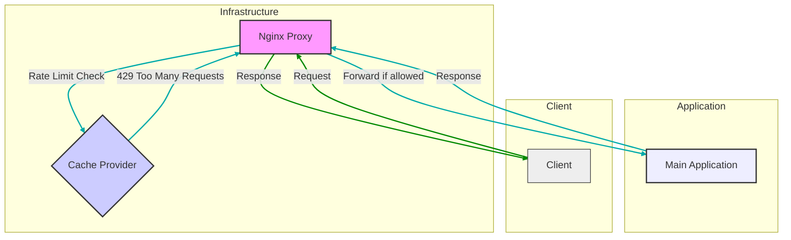
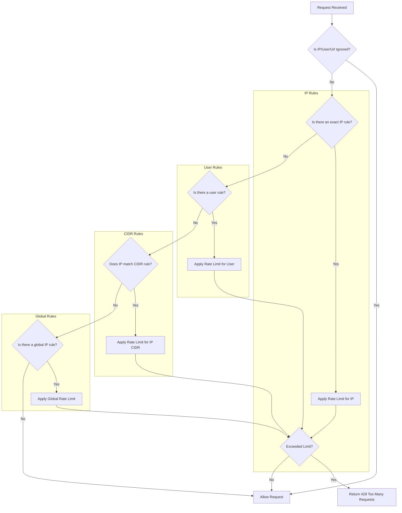

[](https://codecov.io/github/omarfawzi/Nginx-Ratelimiter-Proxy)

# 📌 NGINX Rate Limiter Proxy

- [Overview](#overview)  
- [Key Features](#key-features)  
- [Architecture](#architecture)  
- [Interaction Flow](#interaction-flow)  
  - [Client Request](#interaction-flow)  
  - [NGINX Proxy](#interaction-flow)  
  - [Rate Limiting](#interaction-flow)  
  - [Decision-Making & Request Handling](#interaction-flow)  
  - [Main Application](#interaction-flow)  
  - [Response](#interaction-flow)  
- [Configuration](#configuration)  
  - [Rate Limit Rules](#rate-limit-rules)  
  - [Environment Variables](#environment-variables)  
- [Running the Proxy](#running-the-proxy)  
  - [Docker Setup](#running-the-proxy)  
  - [Custom Resolver](#running-the-proxy)  
- [Why Use Redis Over Memcached?](#-why-use-redis-over-memcached-for-rate-limiting)  
  - [Atomic Operations](#-why-use-redis-over-memcached-for-rate-limiting)  
  - [Support for Different Algorithms](#-why-use-redis-over-memcached-for-rate-limiting)  
  - [Avoiding Redis Replicas](#-why-use-redis-over-memcached-for-rate-limiting)
- [Extending Nginx Configuration with Snippets](#%EF%B8%8F-extending-nginx-configuration-with-snippets)
  - [How It Works](#how-it-works) 
  - [How to Add Custom Snippets](#how-to-add-custom-snippets) 
- [Prometheus](#prometheus)  
- [Request Flow](#request-flow)  
  - [IP Rules](#request-flow)  
  - [User Rules](#request-flow)  
  - [Global Rules](#request-flow)  

## Overview

This lightweight rate limiter serves as a **reverse proxy**, regulating incoming traffic and enforcing rate limits **before requests reach your backend**. By controlling excessive traffic and potential abuse, it enhances both security and performance.

## Key Features

- **Kubernetes Sidecar Proxy**: Designed to manage traffic **before it enters your main application container**, ensuring seamless rate limiting within a Kubernetes environment.
- **NGINX + Lua**: Implemented using **Lua scripting within NGINX**, leveraging `lua-resty-global-throttle` and `lua-resty-redis`.
- **Flexible Caching**: Supports both **Redis** and **Memcached** as distributed caching providers.
- **Configurable Rules**: Rate limit rules are **defined in a YAML file**, allowing for flexible and dynamic configurations.

## Architecture



## Interaction Flow

1. **Client Request**: The client sends a request to the application.
2. **NGINX Proxy**: The request is intercepted by the NGINX proxy.
3. **Rate Limiting**: The proxy checks the request against the rate limiting rules defined in the YAML file.
4. **Decision-Making & Request Handling**:
   - **Ignored Segments**: The request IP/user is first checked against the ignoredSegments configuration. If matched, rate limiting is bypassed, and the request is forwarded.
   - **Rate Limit Exceeded**: If the request exceeds the defined rate limit, a `429 Too Many Requests` response is immediately returned to the client.
   - **Rate Limit Within Limits**: If the request is within the rate limit, it is proxied to the main application.
   - **Lua Exception Handling**: In the event of an exception within the Lua rate limiting script, the request is still proxied to the main application (this should be carefully considered and potentially logged/monitored).
   - **Rules Precedence**: Explicit IP addresses in the configuration take priority over users and generic CIDR ranges (e.g., 0.0.0.0/0).
5. **Main Application**: The request is processed by the main application if it passes the rate limiting check.
6. **Response**: The main application's response travels back through the NGINX proxy to the client.

## Configuration

### Rate Limit Rules

Rate limit rules are defined in the ratelimits.yaml file. The structure of the YAML file is as follows:

```yaml
ignoredSegments:
   users:
      - admin
   ips:
      - 127.0.0.1
   urls: 
     - /v1/ping

rules:
  /v1:
    users:
      user2: 
        limit: 50
        window: 60
    ips:
      192.168.1.1: 
        limit: 200
        window: 60
  ^/v2/[0-9]$:
    users:
      user3:
        limit: 30
        window: 60
```
- `ignoredSegments`: Defines users, IPs and URLs for which rate limiting should be skipped. This is useful for administrative users, urls or specific trusted IPs.
- `rules`: Contains the rate limit rules for different URI paths.
- `path`: The URI path to which the rate limit applies, to apply ratelimits for all paths you can provide `/` as a global path, for regex paths refer to https://github.com/openresty/lua-nginx-module?tab=readme-ov-file#ngxrematch.
- `user/IP`: The user or IP address to which the rate limit applies.
- `limit`: The maximum number of requests allowed within the time window.
- `window`: The time window in seconds during which the limit applies.


> 🔹 **Configuration Note**:  
> Ensure that your `ratelimits.yaml` file is mounted to:  
> `/usr/local/openresty/nginx/lua/ratelimits.yaml`
>
> 🔹 **Global Rate Limiting (`0.0.0.0/0`)**:  
> If `0.0.0.0/0` is specified in the rules, rate limiting will be **applied per IP** rather than globally.  
> For example, if the limit is set to **10 requests per second (RPS)** and two clients—`127.0.0.1` and `127.0.0.2`—make requests, each IP will be allowed **10 RPS independently**.

### Environment Variables

The following environment variables need to be set:

- `UPSTREAM_HOST`: The hostname of the main application.
- `UPSTREAM_TYPE`: The type of upstream server. Valid values are:
   - `http`: For HTTP upstreams.
   - `fastcgi`: For FastCGI upstreams.
- `INDEX_FILE`: The default index file for FastCGI upstreams (e.g., `index.php`).
- `SCRIPT_FILENAME`: The script filename for FastCGI upstreams (e.g., `/var/www/app/public/index.php`).
- `UPSTREAM_PORT`: The port of the main application.
- `CACHE_HOST`: The hostname of the distributed cache.
- `CACHE_PORT`: The port of the distributed cache.
- `CACHE_PROVIDER`: The provider of the distributed cache, either `redis` or `memcached`.
- `CACHE_ALGO`: Specifies the rate-limiting algorithm to use. Options include `fixed-window`, `sliding-window`, or `token-bucket`, defaults to `token-bucket`. This setting is only applicable when using `redis`.

> To enable either `FastCGI` or `HTTP` upstreams, set the `UPSTREAM_TYPE` environment variable to the desired value (`fastcgi` or `http`).

## Running the Proxy

To run the NGINX Rate Limiter Proxy using Docker, you need to mount the rate limit configuration file and set the required environment variables.

```sh
docker run --rm --platform linux/amd64 \
  -v $(pwd)/ratelimits.yaml:/usr/local/openresty/nginx/lua/ratelimits.yaml \
  -e UPSTREAM_HOST=localhost \
  -e UPSTREAM_TYPE=http \
  -e UPSTREAM_PORT=3000 \
  -e CACHE_HOST=mcrouter \
  -e CACHE_PORT=5000 \
  -e CACHE_PROVIDER=memcached \
  ghcr.io/omarfawzi/nginx-ratelimiter-proxy:master
```

#### Custom Resolver

You can mount your own `resolver.conf` file to: `/usr/local/openresty/nginx/conf/resolver.conf` in order to use a custom resolver.

## 🔹 Why Use Redis Over Memcached for Rate Limiting?

When implementing **rate limiting**, Redis is generally preferred over Memcached due to its ability to handle atomic operations and structured data efficiently:

#### ✅ Atomic Operations
Redis provides **atomic increment (`INCR`) and expiration (`EXPIRE`)** commands, ensuring **race-condition-free** updates. Memcached lacks built-in atomic counters with expiration, making it less reliable for rate limiting.

#### ✅ Support for Different Algorithms
Supports multiple rate-limiting algorithms, including fixed window, sliding window, and token bucket.

#### ✅ Per-Key Expiration
Redis allows **TTL (time-to-live)** per key, ensuring **automatic counter resets** without requiring external cleanup logic.

#### ✅ Consistency & Accuracy
Redis executes commands in a **single-threaded atomic manner**, preventing **race conditions** when multiple requests update the same counter.

#### 🚀 Conclusion
Redis provides **precise, reliable, and scalable rate limiting**, while Memcached **lacks the necessary atomicity and data structures** for advanced rate-limiting techniques.

### ⚠️ Important: Avoid Using Redis Replicas for Rate Limiting

Using Redis replicas for rate limiting is **not recommended** due to potential delays in data replication. Redis replication is **asynchronous**, meaning there can be a **lag** between the master and replica nodes. This can result in **inconsistent rate limits**, where some requests might pass even after exceeding the limit due to stale data in the replica.

To ensure accurate and real-time enforcement of rate limits:
- **Always use the Redis master instance** for both read and write operations related to rate limiting.
- Replicas should only be used for **read-heavy** operations that are not time-sensitive.

Using a replica for rate limiting can lead to bypassing rate limits and unexpected behaviors, defeating the purpose of traffic control.

## 🛠️ Extending Nginx Configuration with Snippets

This setup allows for easy customization by including additional **snippet** files. These snippets let you extend the core Nginx configuration without modifying `nginx.conf`.

### How It Works
The Nginx configuration is designed to include external snippet files from the `/usr/local/openresty/nginx/conf/` directory:

- **`http_snippet.conf`**: Modify http settings, applied to the http context.
- **`server_snippet.conf`**: Modify server-wide settings, applied to the server context.
- **`location_snippet.conf`**: Customize location-based routing and proxying, applied to the location context.
- **`resolver.conf`**: Define custom DNS resolvers

Nginx will automatically load these files if they exist.

### How to Add Custom Snippets
To extend the logic, create your snippet files and mount them into the container:

```sh
docker run -d \
  -v $(pwd)/snippets/http_snippet.conf:/usr/local/openresty/nginx/conf/http_snippet.conf \
  -v $(pwd)/snippets/server_snippet.conf:/usr/local/openresty/nginx/conf/server_snippet.conf \
  -v $(pwd)/snippets/location_snippet.conf:/usr/local/openresty/nginx/conf/location_snippet.conf \
  ghcr.io/omarfawzi/nginx-ratelimiter-proxy:master
```

## Prometheus

Prometheus metrics are exposed on port `9145` at the `/metrics` endpoint. This can be accessed via:

```sh
curl http://<server-ip>:9145/metrics
```
This endpoint provides various statistics, including:

- `nginx_proxy_http_requests_total`: Total number of HTTP requests categorized by host and status.
- `nginx_proxy_http_request_duration_seconds`: Histogram tracking request latency.
- `nginx_proxy_http_connections`: Gauge tracking active connections (reading, writing, waiting).

### Request flow 


