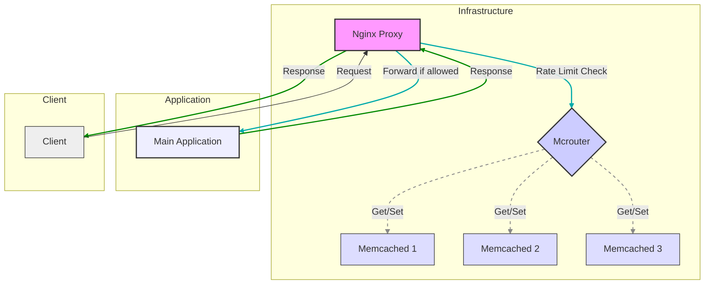

# NGINX Rate Limiter Proxy

## Overview

This lightweight rate limiter acts as a reverse proxy in front of your main application, controlling incoming traffic and enforcing rate limits before requests reach your backend. It helps protect your application from excessive traffic and potential abuse.

The rate limiter is implemented using Lua scripting within NGINX, leveraging the `lua-resty-global-throttle` and `lua-resty-ipmatcher` libraries. Rate limit configurations are defined in a YAML file, allowing flexible and dynamic rule enforcement.

## Architecture



## Interaction Flow

1. **Client Request**: The client sends a request to the application.
2. **NGINX Proxy**: The request is intercepted by the NGINX proxy.
3. **Rate Limiting**: The proxy checks the request against the rate limiting rules defined in the YAML file.
4. **Decision-Making & Request Handling**:
   - **Ignored Segments**: The request IP/user is first checked against the ignoredSegments configuration. If matched, rate limiting is bypassed, and the request is forwarded.
   - **Rate Limit Exceeded**: If the request exceeds the defined rate limit, a 429 Too Many Requests response is immediately returned to the client.
   - **Rate Limit Within Limits**: If the request is within the rate limit, it is proxied to the main application.
   - **Lua Exception Handling**: In the event of an exception within the Lua rate limiting script, the request is still proxied to the main application (this should be carefully considered and potentially logged/monitored).
   - **IP Precedence**: Explicit IP addresses in the configuration take priority over generic CIDR ranges (e.g., 0.0.0.0/0).
5. **Main Application**: The request is processed by the main application if it passes the rate limiting check.
6. **Response**: The main application's response travels back through the NGINX proxy to the client.

## Configuration

### Rate Limit Rules

Rate limit rules are defined in the ratelimits.yaml file. The structure of the YAML file is as follows:

```yaml
ignoredSegments:
   users:
      - admin
   ips:
      - 127.0.0.1

rules:
  /path1:
    user2: { limit: 50, window: 60 }
    "192.168.1.1": { limit: 200, window: 60 }
  /path2:
    user3: { limit: 30, window: 60 }
```
- `ignoredSegments`: Defines users and IPs for which rate limiting should be skipped. This is useful for administrative users or specific trusted IPs.
- `rules`: Contains the rate limit rules for different URI paths.
- `path`: The URI path to which the rate limit applies.
- `user/IP`: The user or IP address to which the rate limit applies.
- `limit`: The maximum number of requests allowed within the time window.
- `window`: The time window in seconds during which the limit applies.

### Environment Variables

The following environment variables need to be set:

- `UPSTREAM_HOST`: The hostname of the main application.
- `UPSTREAM_TYPE`: The type of upstream server. Valid values are:
   - `http`: For HTTP upstreams.
   - `fastcgi`: For FastCGI upstreams.
- `INDEX_FILE`: The default index file for FastCGI upstreams (e.g., `index.php`).
- `SCRIPT_FILENAME`: The script filename for FastCGI upstreams (e.g., `/var/www/app/public/index.php`).
- `UPSTREAM_PORT`: The port of the main application.
- `MCROUTER_HOST`: The hostname of the McRouter server.
- `MCROUTER_PORT`: The port of the McRouter server.

> To enable either **FastCGI** or **HTTP** upstreams, set the **UPSTREAM_TYPE** environment variable to the desired value (**fastcgi** or **http**).